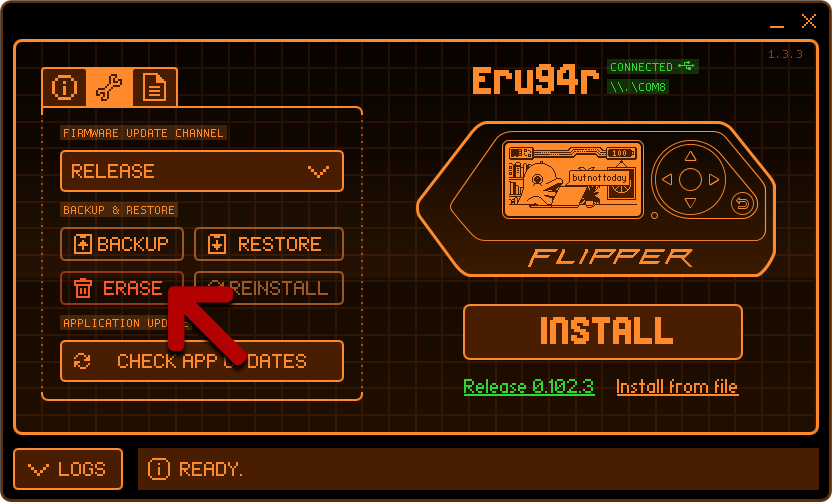

# FlipperZero-CN-Firmware 中文固件说明：

<h4>本固件目前基于Momentum固件制作，意在打造本土化中文固件，方便国人上手Flipper Zero，尽可能降低学习成本。</h4>

<h4>同时针对国内使用场景，增加各种符合国人使用需求的功能，尽可能解决Flipper Zero在国内的各种水土不服。</h4>

本人常出没在B站(bilibili.com)，也算是UP主，制作该固件的初衷，本是服务于接下来准备制作的一系列Flipper Zero中文教程。

目前固件以及教程正在有条不紊的制作，感兴趣的朋友可以去关注一下。

我的B站主页：https://space.bilibili.com/404214439

Flipper Zero 中文固件发布：https://www.bilibili.com/video/BV1d1421X7uY

Flipper Zero 是什么该怎么玩：https://www.bilibili.com/video/BV1mx4y1i7QH

Flipper Zero 相关功能及操作说明：https://www.bilibili.com/video/BV1RD42137gm

Flipper Zero 固件的选择、更新、避坑以及救砖：https://www.bilibili.com/video/BV1m6421Z747

Flipper Zero 如何利用IC卡漏洞解卡：https://www.bilibili.com/video/BV1si421e7ra

Flipper Zero 如何利用读卡器漏洞解卡：https://www.bilibili.com/video/BV1cz421z7WH

Flipper Zero 如何复制门禁电梯等IC卡：https://www.bilibili.com/video/BV17S421R7RU

Flipper Zero 常见IC读卡器的漏洞检测：https://www.bilibili.com/video/BV1tE421P7c5

## 固件视频介绍：

## 固件刷新方法：

请参考[固件更新方法及问题2.0](Update_doc/ReadMe.md)

## 使用注意事项：

**0、更新中文固件时建议使用qFlipper->Advanced Controls->ERASE清理一下内部空间，这将极大改善刷新固件时可能发生的问题(该功能不会影响SD卡中的文件)。**

1、第一次安装中文固件前建议格式化SD存储卡

2、更新后按键绑定出错（提示应用程序不存在），建议重置一遍按键绑定。（更新前格式化过SD卡，一般不会出现此问题）

3、使用第三方个性化资源包，需要删除包中Fonts目录，目录中为英文字库文件，不包含中文，因此加载会导致汉化失效和宕机。

4、汉化必然导致更多系统资源被占用，可能会导致稳定性下降，希望大家能有正确认视。

##  BUG提交：

汉化切入点以使用较频繁的功能界面为主，系统通知、报错等信息界面优先汉化了较常见的，部分不常用的功能和界面可能有所忽略

1、发现有遗漏未汉化界面的

2、界面不美观、缺字、显示不完整的

3、功能描述错误或者有更好表述方法的

4、因汉化导致的功能性错误的

5、发现其他问题的

大家测试发现后尽量以截图形式发到群或直接在B站视频下留言或者私信。

## 公测QQ群：

公测QQ群: [530379583](https://qm.qq.com/q/1DlppfAT08)

## 版本更新及大事记：

最新版本说明请查看文档开头版本更新说明

2024-4-30 20240430公测版正式发布

2024-4-30 20240428内测B4版提交内侧群开始内测

2024-4-29 20240428内测B3版提交内侧群开始内测

2024-4-29 20240428内测B2版提交内侧群开始内测

2024-4-28 20240428内测B1版提交内侧群开始内测

2024-4-26 果仁弃更汉化固件最终版1.05b免费发布

2024-4-25 第一版展示视频小范围公布，内测群建立

2024-4-19至4-24 闭关开始汉化工作

2024-4-18 联系无果决定从0开始汉化固件，通过“别抱我幼辞”验证了汉化的可能性

2024-4-17 决定基于果仁汉化固件制作教程，试图联系果仁寻求合作可能及使用授权

2024-4-13至4-16 研究策划相关教学视频

2024-4-13 收到随缘的Flipper Zero

## 感谢帮助过我的朋友们:

<b>[随缘]</b>
接触小海豚源自他的善意。

<b>[墨绿格子]</b>
之所以进他群是因为当年在群里潜水被踢出去过(笑)。

<b>[[别抱我幼辞](https://github.com/Biebaowoyouci)]</b>
帮我验证了汉化的可行性，同时在功能方面帮我良多。

<b>[[Daifresne_TSGP](https://github.com/Daifresne)]</b>
一起探讨了很多扩展模块方面的问题，对我帮助很大。

<b>[哟儿酱]</b>
关于模块和相关功能讲解很细致，节约了大量时间。

<b>[天魔黑兔]</b>
关于模块和射频遥控等技术给我提供了很多帮助。

<b>[羁绊]</b>
在射频遥控方面提供了很多帮助，同时解答了很多困扰我的问题。

<b>[[老葉](https://github.com/oldip)]</b>
对小海豚的方方面面都很了解，在各种功能上均提供了帮助，尤其是近场通信。

<b>[MikozZZ]</b>
在汉化和修改程序过程中提供了帮助，解决了很多实际问题，如版本号及筛选。

## 特别感谢：

感谢随缘大哥的信任，上午刚认识，下午就寄来设备，借我学习研究！非常感谢！

感谢喜欢和关注我的朋友，谢谢你们的陪伴！

## ❤️ 资助开发
如果你喜欢这个固件，请向身边的同好介绍它！如果你希望我能持续更新的话，可以考虑资助我。

> **[B站充电](https://space.bilibili.com/404214439)**: 可以包月充电，也可以自定金额充电(平台会收取一定费用)

> **[支付宝](https://qr.alipay.com/a6x18955zxmede2gw5yac15)**: 资助金额不限(平台不收取手续费)

**感谢你的资助！**
