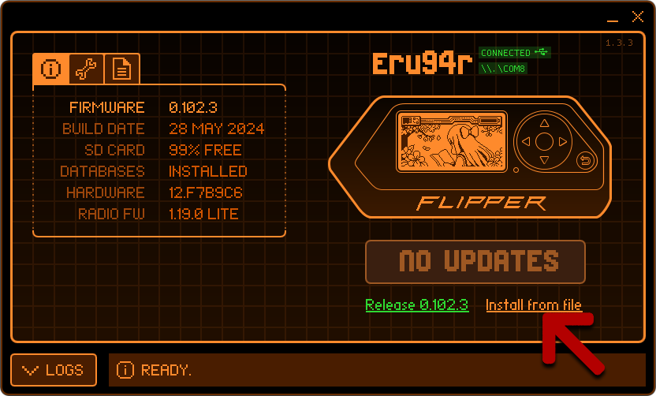
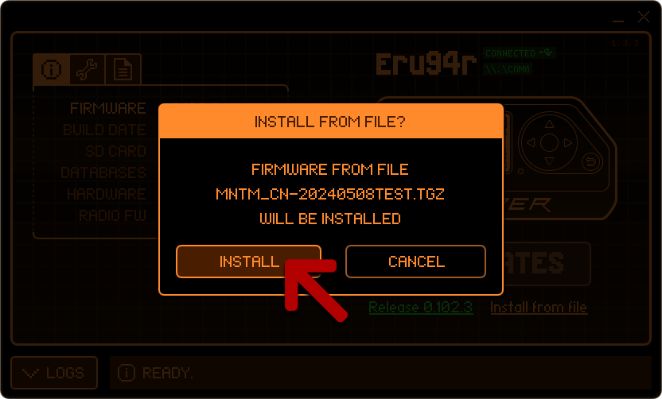
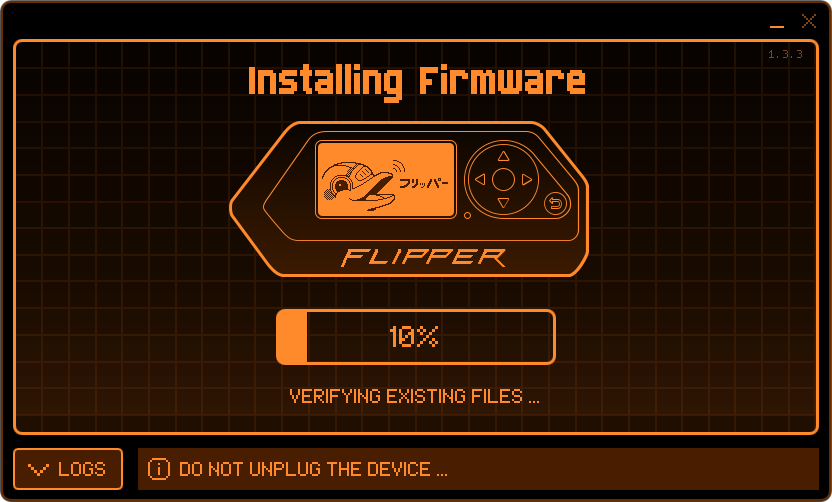
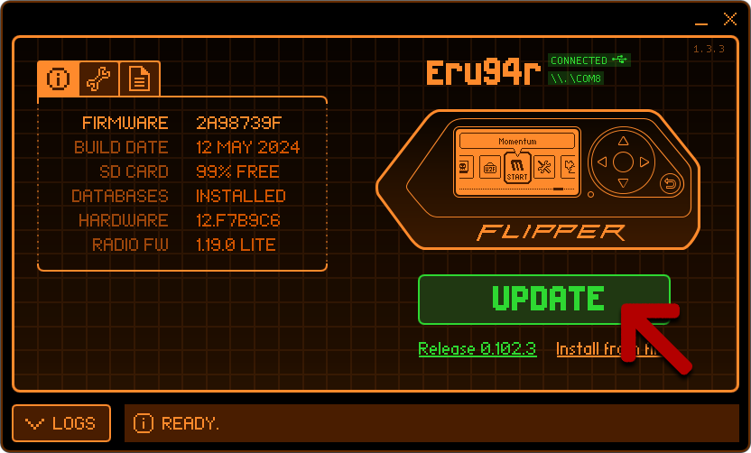
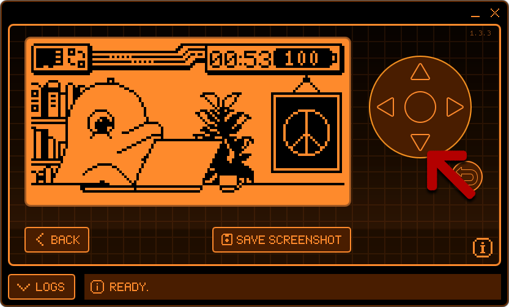
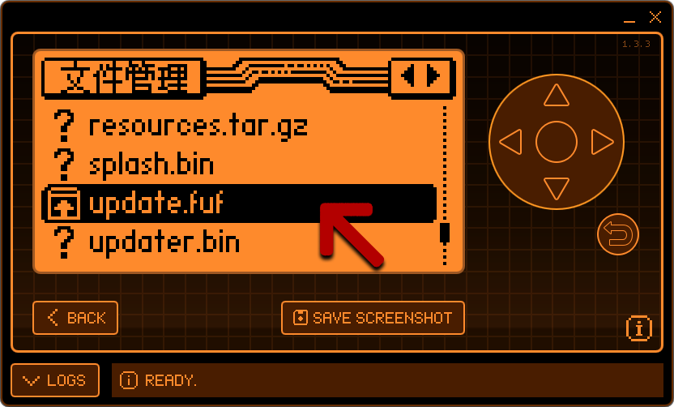
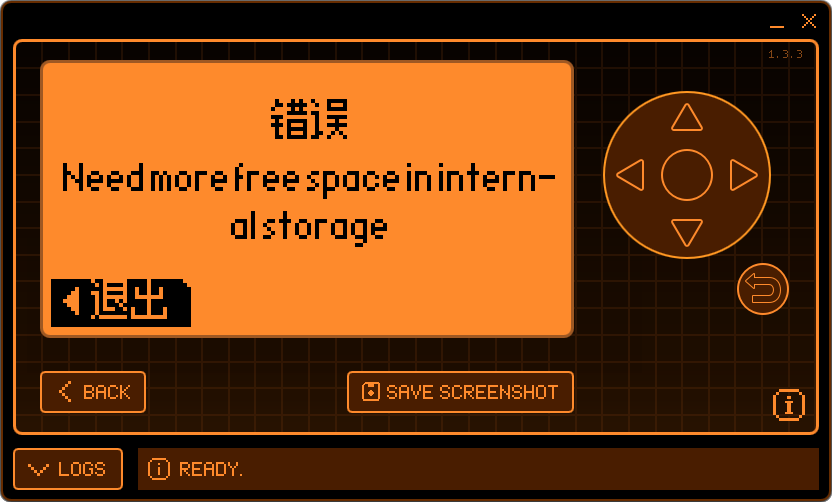

# FlipperZero固件更新说明2.0：

01、点击Install from file 选择更新第三方固件

02、先择下载好的固件，固件格式为.tgz

03、点击Install 确认开始更新固件

04、等待将固件上传到设备的TF存储卡中 
（更新固件时FlipperZero内必须要要TF卡） 
TF卡官方建议使用SanDisk、金士顿、三星，固件升级失败大多跟TF卡有关

05、等待将上传到TF卡中的固件部署到设备Flash和TF中的各目录， 
（此时其实可以断开USB数据线和关闭qFlipper。下面的升级均由设备自身完成）

06、如果没有断开数据线，出现该界面即说明升级完毕，点击Continue完成。

07、升级完成后，左侧Firmware会显示新的版本号。

  

# 更新失败的处理方法：

01、点击Erase擦除设备内部存储（Flash） 
降低Flash空间占用，可以改善固件部署时可能发生的错误。

02、点击Update更新为官方固件后再刷新第三方固件 
刷入官方固件目的也是为了降低Flash空间占用，改善固件部署时可能发生的错误。

03、更新固件前，在FlipperZero中格式化TF存储卡 
此方法可以改善固件更新后可能存在的一些问题，使用中文固件建议进行格式化。 
（如果用电脑格式化，建议事先备份卡内文件，以便发生未知问题后补救）。

使用官方建议品牌以外的TF卡，格式化后有一定几率改善引TF卡导致的固件更新困难，常见故障为上传固件时卡进度后报错。

04、重启qFlipper，qFlipper反复更新固件时可能会出现BUG，更新失败建议重启。

05、重新连接设备；更换USB数据线；更换USB口。 
固件更新失败大多都是出现在将固件上传进TF卡时，因此上述操作有几率改善此问题。

06、重启电脑。谜之操作，成不成看命(～￣▽￣)～

  

# FlipperZero固件手动更新说明(2021-06-08追加)

固件更新最容易出现问题的步骤就是将固件上传进小海豚的过程中（比如说固件更新时，所有卡%进度条都是这个原因导致的）。 
因此我们介绍一下如何手动将固件上传到TF，然后在小海豚的文件管理器中手动更新。

01、将tgz固件用解压软件打开（图中使用的是winrar），将其中的固件目录上传到小海豚TF卡的update目录中，可以使用qFlipper上传，也可以使用TF读卡器直接拷贝。

02、使用是小海豚进行接下来的操作，数据线可断开，也可以不断开，随意。 
（上图之所以还是qFlipper的界面是为了截图方便，实际操作无需连接qFlipper）

在待机界面点击下键打开文件管理器

03、找到update目录，点击中键（确认键）进入。

04、找到刚刚上传的固件目录，点击中键（确认键）进入。

05、找到update.fuf文件，点击中键（确认键）打开。

06、点击右键开始安装，接下来等待固件安装完毕即可。

注意：所有更新过的固件后会保留在update目录，不管是用电脑客户端qFlipper，还是手机客户端，固件都会先上传到update目录，然后进行部署。

通过手动上传，有效的避免了因数据线、USB口以及客户端本身BUG导致的上传失败问题。

另外，如果点击右键安装固件时出现提示： 
“Error”“Need more free space ininternal storage” 
“错误”“需要更多内部可用空间”

请先尝试在qFlipper中“Erase擦除设备内部存储”或者“恢复出厂设置”后再安装第三方固件，问题都能得到很好的解决。

在擦除和恢复为官方固件之前，建议先备份好TF内的数据。

另外手动更新固件的方法，可以将多个三方、官方固件备份在update目录，可以方便随时切换固件。

该帮助文档为目前所有刷机问题的汇总，日后发现新的问题后也会不断更新。

2024-06-08
宅人改造家
