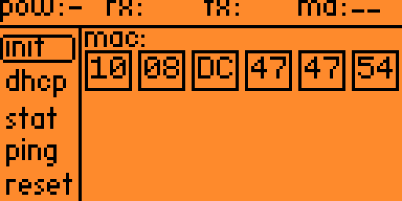
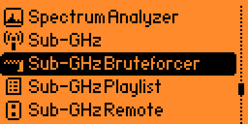
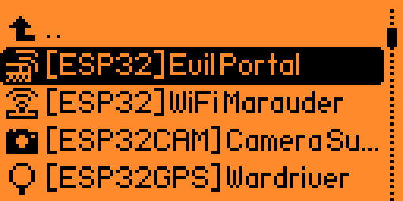
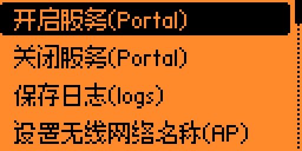
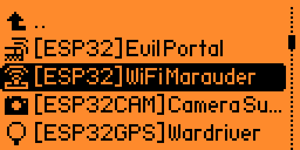
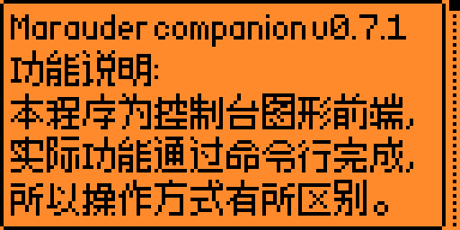
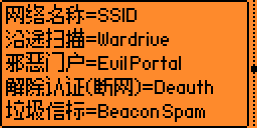

20240508公测版更新日志：
-------------------------------------------------------------------------------------------
**修改了翻译错误：**

屏幕亮度->指示灯亮度

**补充了遗漏：**

nfc_scene_mf_classic_keys.c

列表

nfc_scene_mf_classic_keys_delete.c

删除这个密钥吗?

**精简了字库：**

重新画了部分汉字和字母

修改调整了标点符号的间距

主要是斜杠和反斜杠

**优化了：**

设置中关于界面里的汉化版本信息及原始固件版本信息的展示方式。

**添加程序：**

ethernet_w5500.fap

**汉化了外部程序：**

Sub-GHz Bruteforcer

Evil Portal

WiFi Marauder

调整了一些小细节。。。
