20240601公测版更新日志：
-------------------------------------------------------------------------------------------
**重大更新：**

1、将原始固件版本开从开发版(DEV)(2A98739F)升级为发行板(release) mntm-003(186bc960)，新版本增加了更多特性，

例如:

更直观的固件升级进度

新的SD卡测试引导界面

频率锁解除及扩频提醒界面

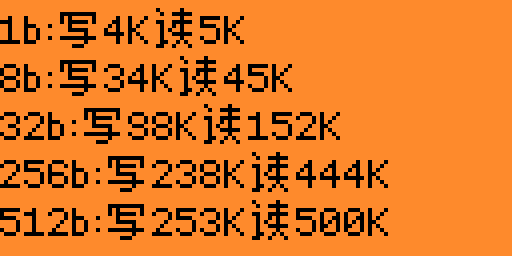

频率锁解除及扩频提醒界面

MNTM设置应用时的重置菜单及应用界面

……

2、尝试使用外部字库，将字库编译到扩展程序内，程序不运行时相关字库不调用，有效改善系统字库增大对稳定性的影响，使用外部字库的程序即便在英文固件下仍可以正常显示中文。

3、从系统字库中去除了与游戏等程序相关的中文字符，进一步降低了系统字库对Flash和内存的占用。

**特别注意：**

mntm-003固件官方调整了扩展程序的目录结构，去掉了WIFI等目录。

将与扩展模块相关的程序重新分类放到了GPIO目录下各自目录中。

比如将跟ESP模块相关的程序放到了GPIO目录下得ESP目录里等。

**游戏：**

新增汉化Air Arkanoid (100%使用外部字库，降低系统字库对Flash和内存的占用)

优化2048 (100%将字库切换为外部字库，降低系统字库对Flash和内存的占用)

优化Snake 2.0 (100%将字库切换为外部字库，降低系统字库内对Flash和内存的占用)

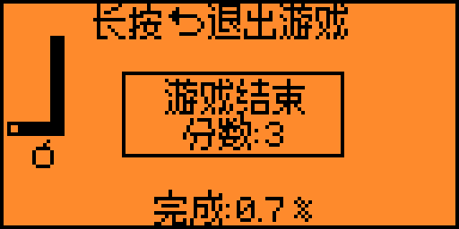

优化Flappy Bird (100%将字库切换为外部字库，降低系统字库对Flash和内存的占用)

优化Tetris (100%将字库切换为外部字库，降低系统字库对Flash和内存的占用)

**程序：**

新增汉化[GPIO] Unitemp 温度传感器程序1.4

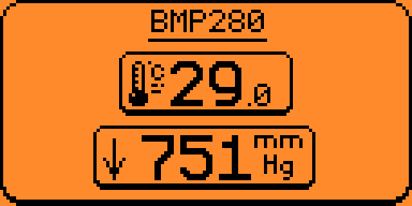

新增汉化[BMI160] Air Mouse 空中飞鼠程序1.1 (90%外部字库，降低系统字库对Flash和内存的占用)

新增汉化[NMEA] GPS 定位模块程序1.3 (100%外部字库，降低系统字库对Flash和内存的占用)

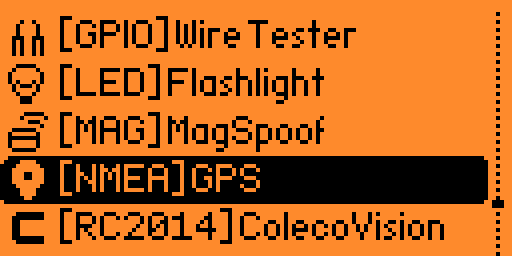
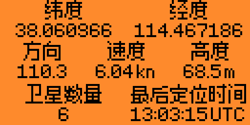

新增汉化[NRF24] Channel Scan 2.4G信道扫描程序1.3 (100%外部字库，降低系统字库对Flash和内存的占用)

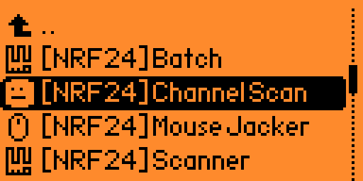
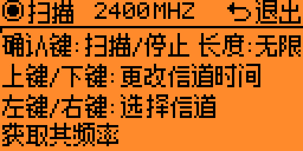

新增汉化[NRF24] Sniffer 2.4G嗅探程序1.1 (100%外部字库，降低系统字库对Flash和内存的占用)

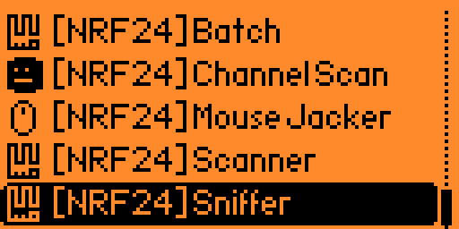
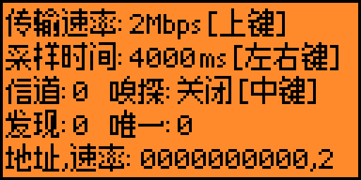

优化Sub-GHz Bruteforcer 3.C

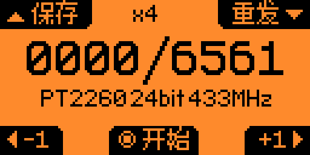

升级HID iClass 1.13 -> 1.15

升级esp-flasher 1.4 添加更多模块及固件支持(如AirTag扫描固件)

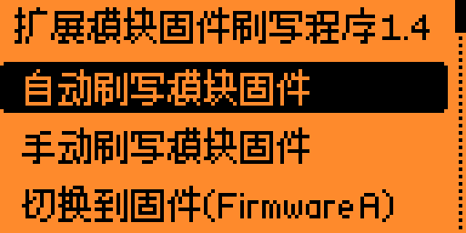

**补充及勘误：**

完善汉化-系统时钟内的计时界面

完善汉化-部分系统提示界面，如程序与固件版本不匹配的提示界面

完善汉化-文件管理器，新建目录、内部空间(设备内部的Flash)

修改勘误-esp-flasher 翻译错误 [>] 开始刷写 - 低速 (S3)

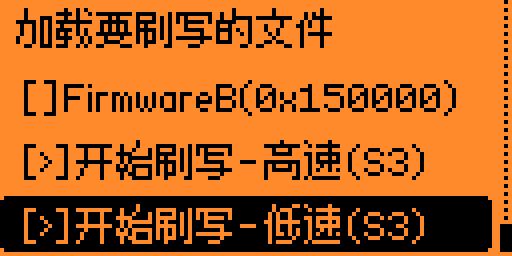

完善汉化的部分译文...

