20240607公测版更新日志：
-------------------------------------------------------------------------------------------
进一步降低系统字库的大小，尽可能降低字库对Flash和内存的占用，逐步将各程序的字库从系统字库中剥离出来，存储在自身程序中(TF卡中)，不运行不加载，节约系统资源。

新增汉化USB Remote USB遥控 (100%外部字库，降低系统字库对Flash和内存的占用)

新增汉化Bluetooth Remote 蓝牙遥控 (100%外部字库，降低系统字库对Flash和内存的占用)

新增汉化Mass Storage USB大容量存储1.3 (100%外部字库，降低系统字库对Flash和内存的占用)

该程序可以用小海豚模拟各种不同大小的U盘，还可以加载ISO镜像。

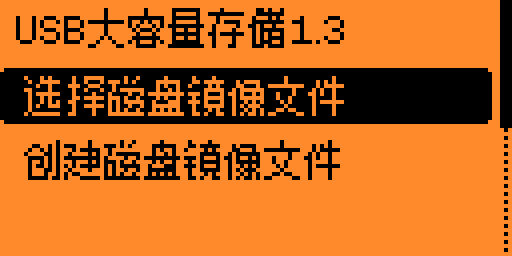
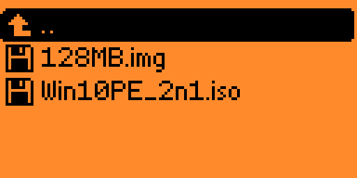
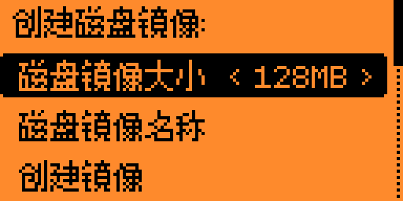

新增汉化[BH1750] Lightmeter 照度计程序1.2 (100%外部字库，降低系统字库对Flash和内存的占用)

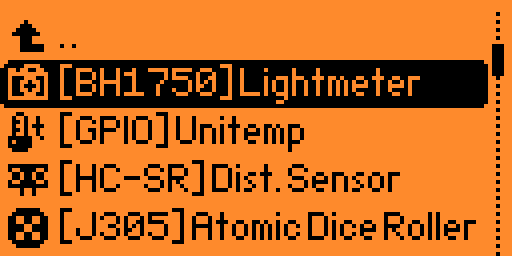
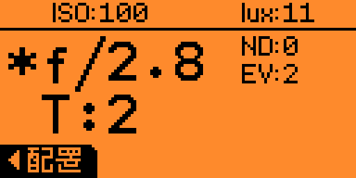
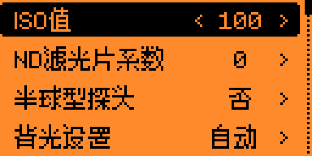

新增汉化[TEA5767] FM Radio FM收音机1.1 (100%外部字库，降低系统字库对Flash和内存的占用)

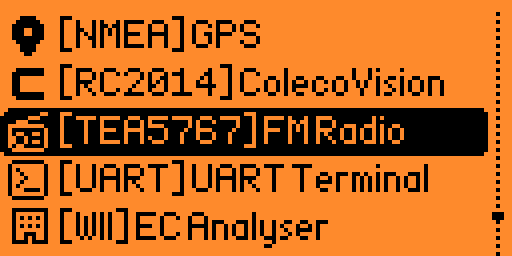

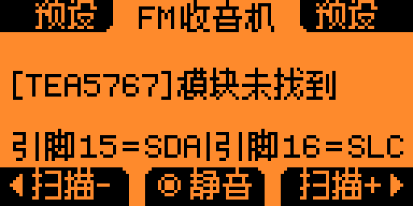

优化[BMI160] Air Mouse 空中飞鼠程序1.1 (100%外部字库，降低系统字库对Flash和内存的占用)

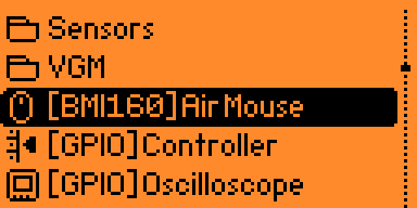
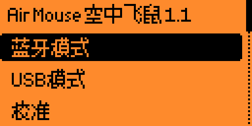

优化[GPIO] Unitemp 温度计程序1.4 (100%外部字库，降低系统字库对Flash和内存的占用)

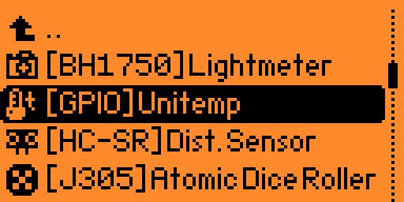

优化[ESP] ESP Flasher 乐鑫ESP固件刷写程序1.4 (100%外部字库，降低系统字库对Flash和内存的占用)

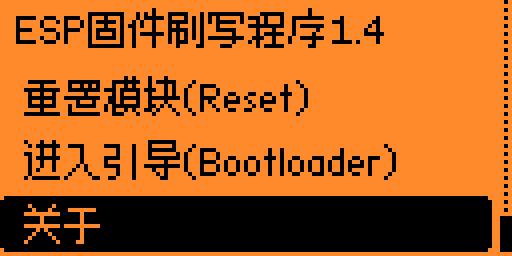
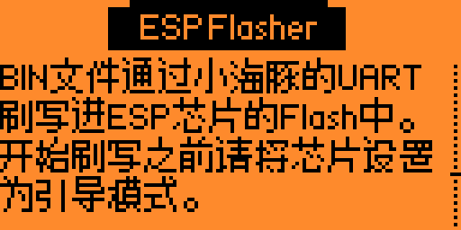

优化[ESP32] Evil Portal 邪恶之门0.0.2 (100%外部字库，降低系统字库对Flash和内存的占用)

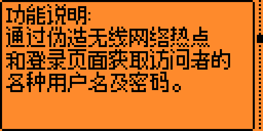

优化[ESP32] WiFi Marauder WIFI掠夺者0.7.1 (100%外部字库，降低系统字库对Flash和内存的占用)

优化HID iClass (PicoPass) 1.15 (100%外部字库，降低系统字库对Flash和内存的占用)

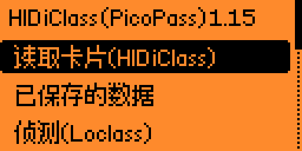

添加[TEA5767] FM Radio 1.1

添加[W5500] Ethernet 1.0

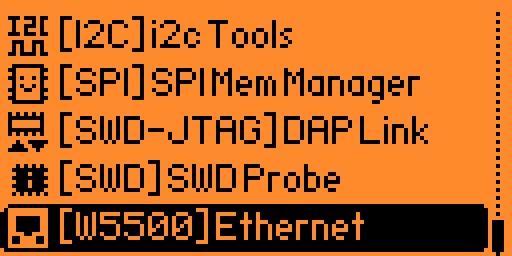

汉化三方设备报错界面

汉化卡内固件升级的相关提示界面

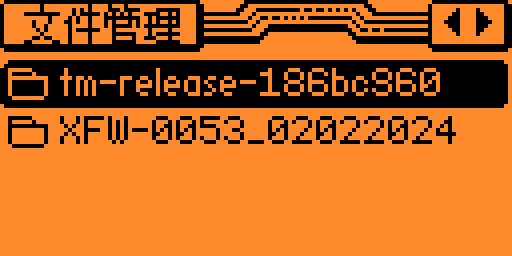

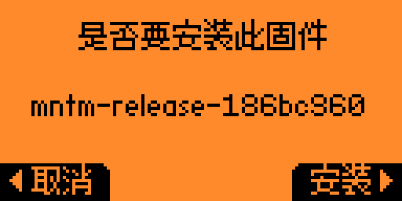

汉化重启时的相关提示界面

修复射频信号无法删除的问题

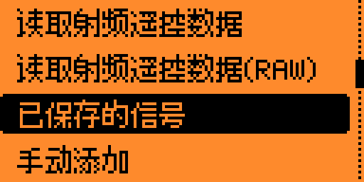
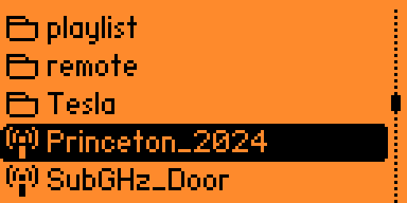

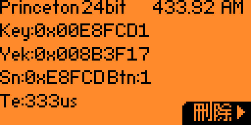
