20240629公测版更新日志：
-------------------------------------------------------------------------------------------
将系统设置中所有选项的字库从系统字库中去除，全部修改为外部字库，降低系统字库大小，节省更多系统资源。

制作添加了 Tools/System Info 系统信息 0.1 用于查看系统信息。

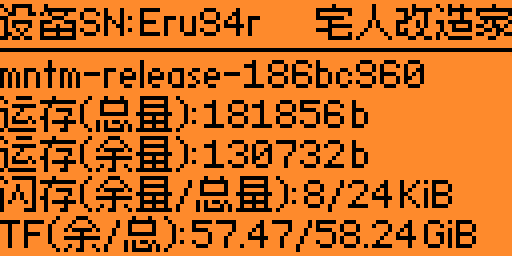

制作该程序的初衷是为了在汉化过程中随时查看系统信息，分析固件的优化情况。之前只在私下进行了分享，朋友觉得程序很方便，绑定快捷键以后可以随时查看系统信息。因此决定正式加入汉化固件之中，通过该程序可以随时了解运行内存，闪存以及TF卡的使用情况。因为是内部测试程序，姑且算是0.1版。

#### 汉化电池信息界面

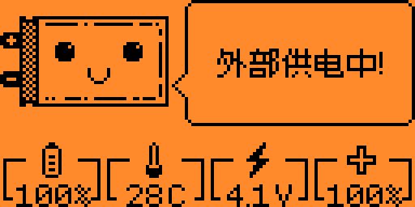
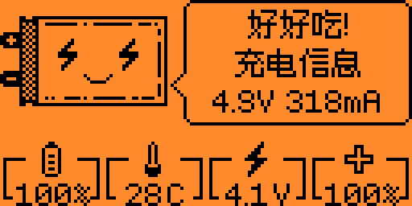

#### 修改程序加载报错界面

#### 汉化插入存储卡提示界面

#### 汉化Sub-Ghz存储卡报错界面

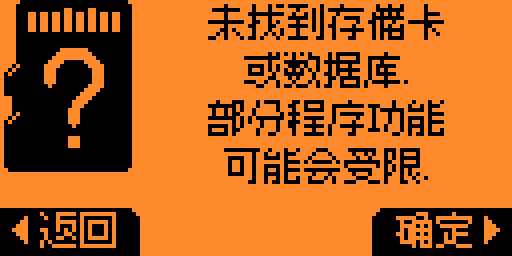

#### 修改Sub-Ghz发送被阻止界面，优化解锁向导

#### 优化侦测后的解卡提示界面

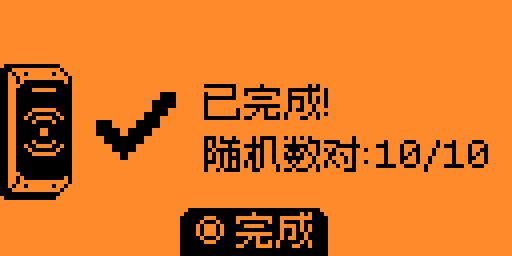
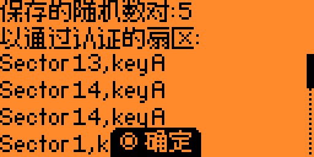
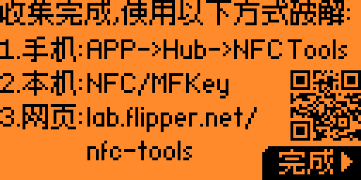

#### 优化NFC->其他操作：

读取 NTAG/Ultralight

->

读取 Nintendo Amiibo (用于读取任天堂Amiibo玩偶中的数据，从而模拟)

读取 Xiaomi Air Purifier (用于读取小米空气净化器滤芯的数据。从而修改消耗%)

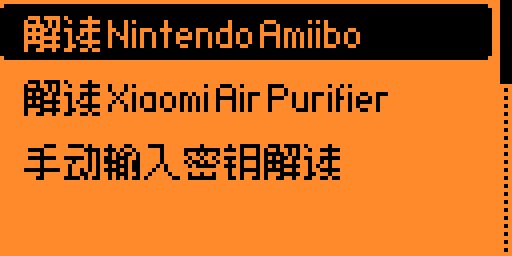

读取 SLIX-L

->

读取 Toniebox (用于读取Toniebox儿童音乐盒玩偶中的数据，从而模拟)

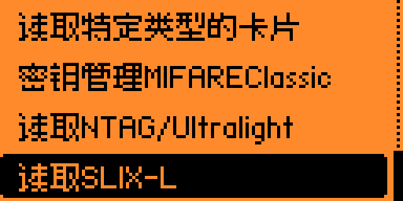
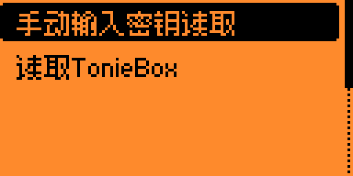

#### 完善固件升级过程中的报错界面

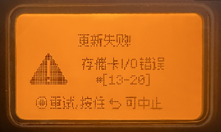

#### 修改输入法确认按钮，由“保存”变更为“完成”

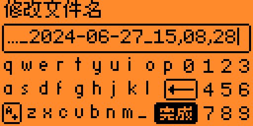

#### 汉化 Enhanced Sub-Ghz Chat 增强Sub-Ghz聊天应用

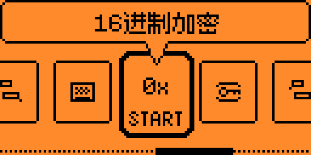
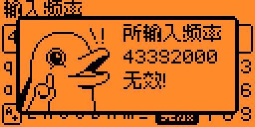
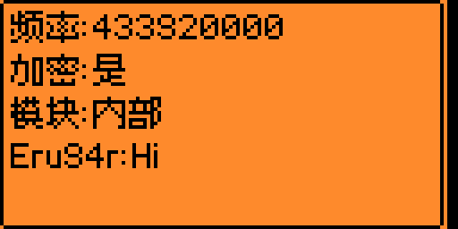

修改部分杂项就不一进行说明了
