20240706公测版更新日志：
-------------------------------------------------------------------------------------------

momentum设置程序字库补全，之前将momentum设置程序的字库从系统字库中剥离时，有个别汉字遗漏，目前已彻底补全。

汉化系统报错信息，内存不足

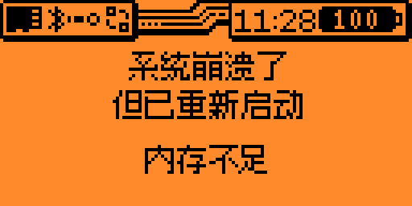

### NFC Magic 复制卡写入程序 1.10

全面分析了该程序所支持的复制卡类型，针对国内常见复制卡进行了优化，在程序内增加了帮助文档，方便国人使用。

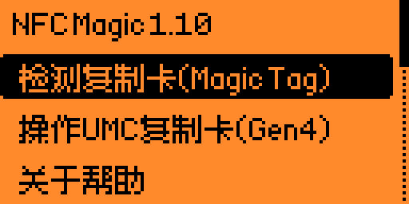

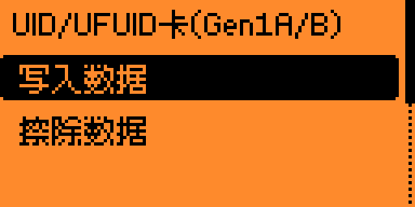

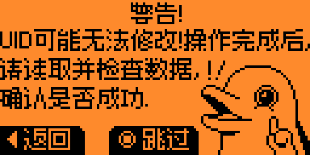
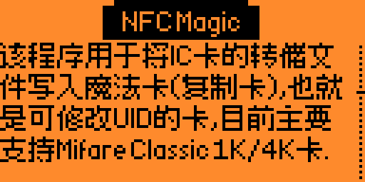
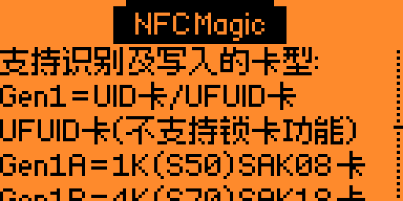
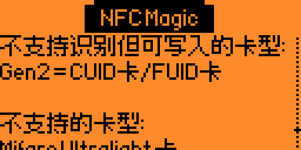
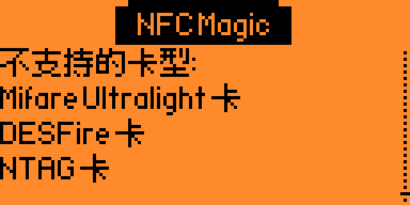

### MIFARE Classic Editor M1卡编辑程序 1.0

该程序的作用是编辑Mifare Classic 1K卡的转储文件，可以直接编辑UID卡号，校验位、厂商码、AB密钥以及控制位，程序简单易用，对于分析学习M1卡有很积极的作用。

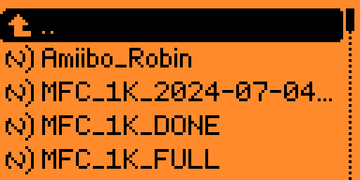
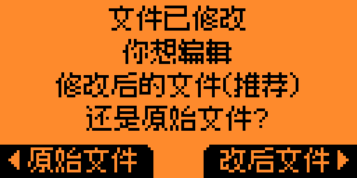

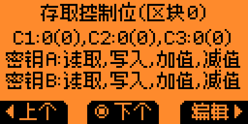

### NFC Maker NFC快捷标签的写入程序 1.1

使用该程序可以将各种快捷指令写入NTAG标签中，功能与安卓手机上的NFC Tools Pro、NFC标签助手功能相近，将快捷指令写入NTAG标签，或直接模拟后，使用手机扫描可实现相应功能

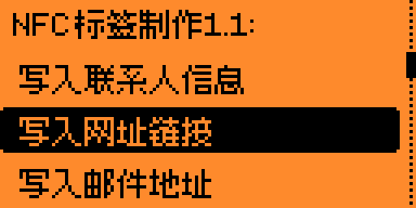
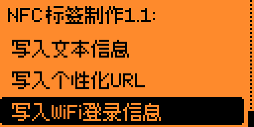
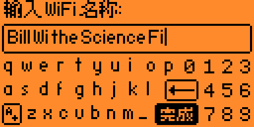

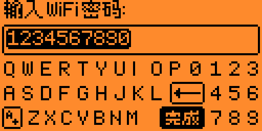

修改固件版本号显示方式，使其在qFlipper中显示更完美，不再将左侧边框撑的变形(感谢Miko帮我解决了这个问题)。

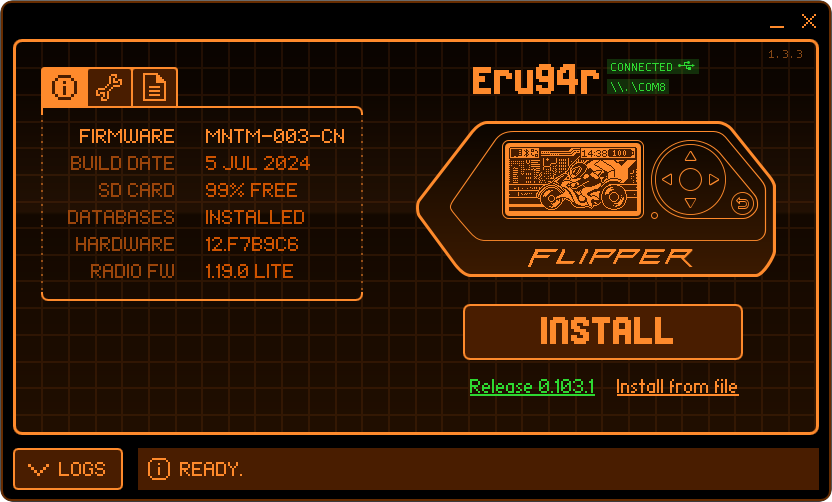

