20240712公测版更新日志：
-------------------------------------------------------------------------------------------

核心程序的汉化工作非常复杂，需要逐一测试，搞清每一个功能选项的实际作用，以及还可能用于哪些方面。由于需要购买大量物料用于测试，因此汉化周期会较长，所以接下来更新周期和每次更新的内容可能会放缓。

系统设置程序字库补全，之前将系统设置程序的字库从系统字库中剥离时，有个别汉字遗漏，目前已彻底补全。

补全Mifare Nested中部分遗漏的字库。

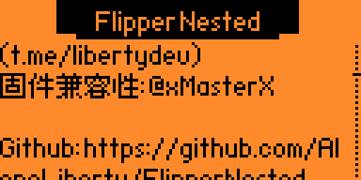

调整HID iClass (PicoPass) 已保存数据中的卡片管理菜单，将模拟选项放置在了第一位，以便快速模拟。添加关于帮助，方便大家理解程序作用

汉化Mifare Fuzzer 漏洞检测 1.3 添加关于帮助，方便大家理解程序作用

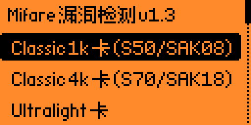
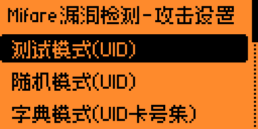

汉化NFC Playlist 模拟列表 2.1 添加关于帮助，方便大家理解程序作用

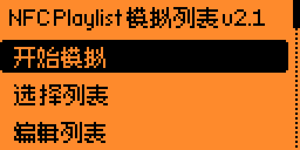
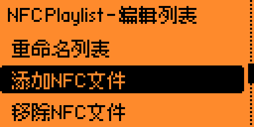
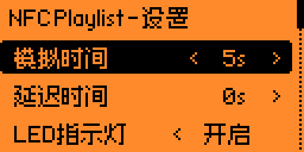

完善integrity 相关说明及维权 增加特别鸣谢，逐一感谢将这一路上帮助过我的朋友们。

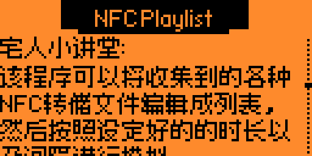
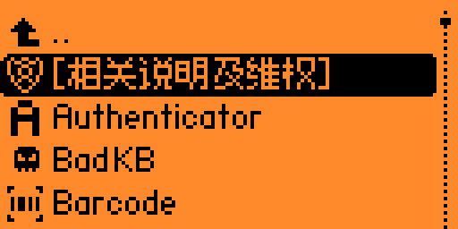

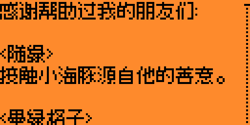
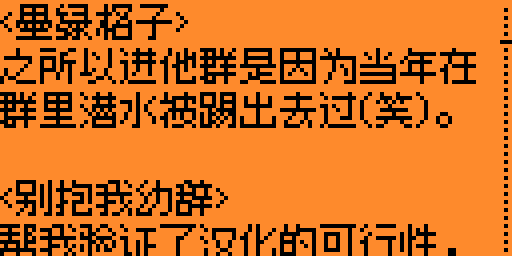
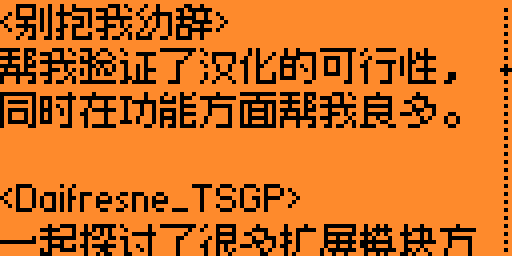
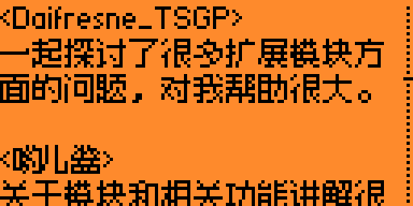
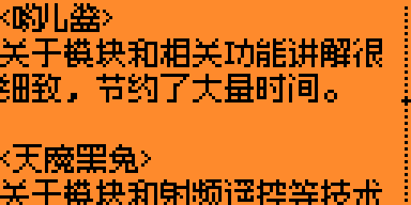

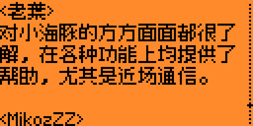
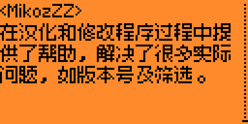
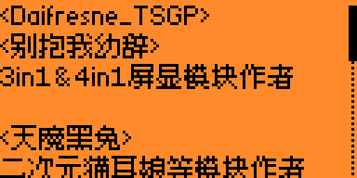

