20240803公测版更新日志：
-------------------------------------------------------------------------------------------
**【重要】为“通用红外遥控器”增加国内常见品牌遥控编码**

电视类(tv.ir):
星星一战：TCL、创维、海信、长虹、乐视、夏普、康佳、小米
Mr.KL：LG、SONY、Samsung、Panasonic

投影类(projectors.ir):
星星一战：爱国者、爱普生、华为、极米、佳能、坚果、康佳、三星

音响类(audio.ir):
星星一战：安桥、傲立、丹尼克斯、马兰士、索尼、雅马哈

风扇类(fans.ir):
Mr.KL：Basa、Daewoo、Origo、Rasonic

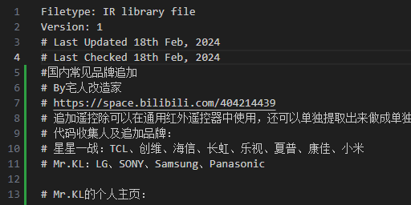

遥控文件储存在SD Card/infrared/assets/目录下，文件中有详细说明，各品牌均能提取作为独立遥控器使用。

Mr.KL的个人主页： 
https://youtube.com/@master_kl?si=R-2LKJYGTUMiSzhj 
https://www.facebook.com/GeekMasterKL?mibextid=LQQJ4d 
有兴趣的可以去观摩哦！

**程序汉化：**

BLE Spam 蓝牙垃圾信息 6.4 
程序通过蓝牙循环发送垃圾信息(例如弹窗代码)来干扰被攻击设备正常使用。

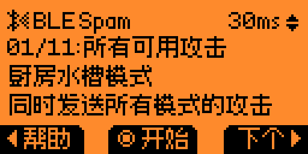
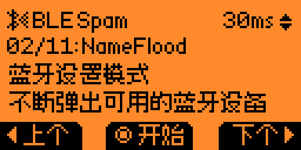
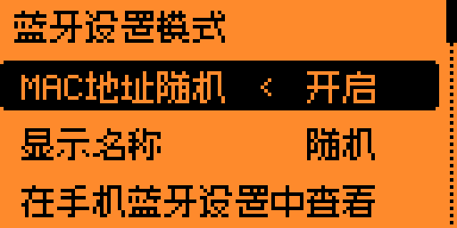
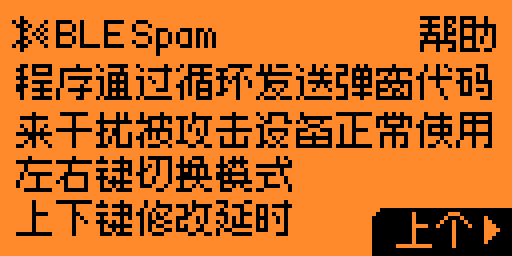

BT Trigger 蓝牙快门 1.3 
通过蓝牙连接手机等IOS设备后后，可以远程控制摄影摄像，还可以设置间隔时间来进行延时摄影。

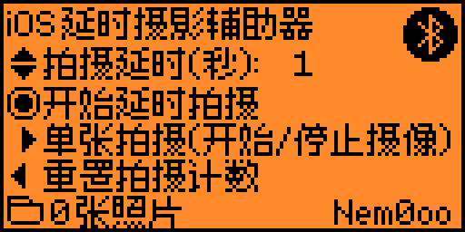

PC monitor 电脑系统监视器 1.0 
配个电脑端程序可以在Flipper Zero上显示CPU、内存、显卡、显存系统信息(显卡仅支持N卡)。

PC端程序下载地址： 
https://github.com/TheSainEyereg/flipper-pc-monitor-backend/releases

USB Consumer Control 商业设备控制 1.0 
通过发送USB CCBs启动和控制设备上的应用程序。

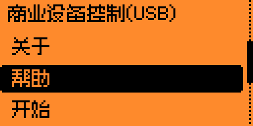

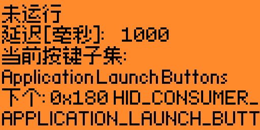

**游戏汉化：**

[塔罗牌]Tarot 0.1(独立字库)

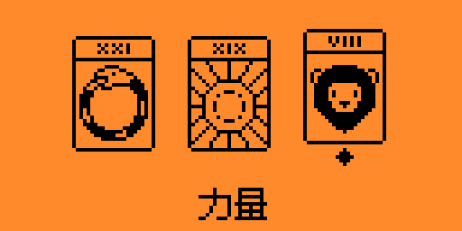

**程序添加：**

添加 Sub-GHz / TPMS Reader 胎压阅读器 0.1 
该程序用于读取胎压传感器的数据。

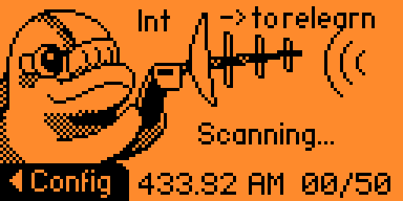
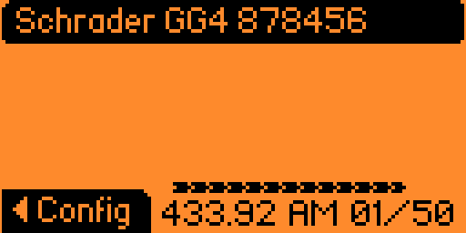
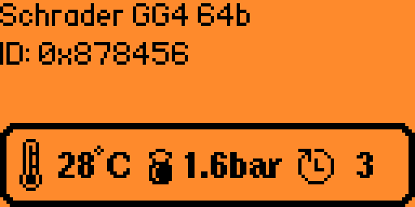
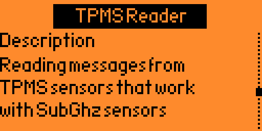

支持以下传感器： 
Schrader GG4 
Abarth 124 (soon)

**其他修改：**

QR Code 二维码生成器 2.0 
添加样例文件qrcode_v1.qrcode和qrcode_v1.qrcode，分别对应V1和V2版的二维码

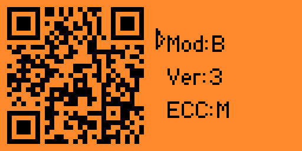
